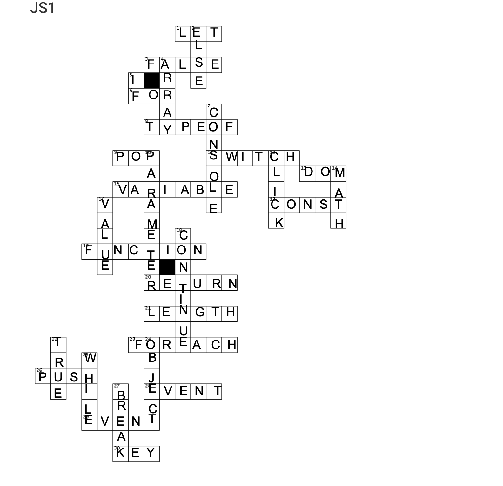

# Javascript Fill in the Blanks 

--- 

1. JavaScript is a client-side scripting language.
2. You can declare a variable using let, const, or var.
3. To assign a string to a variable, use quotes like this:
   let name = "Alice";
4. The function keyword is used to define a function.
5. To output something in the browser console, you use console.log().
6. The data type that stores true or false values is called Boolean.
7. To compare two values for equality in value and type, use ===.
8. The loop that runs as long as a condition is true is the while loop.
9. In JavaScript, arrays are defined using square brackets.
10. An if statement checks for a condition to decide what code to run.
11. HTML elements can react to JavaScript using events like onclick.
12. The method to convert a string to a number is Number().
13. To add a new element to the end of an array, use array.push().
14. To check the length of a string, use string.length.
15. The operator + can be used for both addition and concatenation.
16. JavaScript code is typically run inside the web browser or using Node.js for server-side JavaScript.
17. You can use document.getElementById() to access an HTML element by its id.
18. The keyword used to stop the execution of a loop is break.
19. A function can return a value using the return keyword.
20. The typeof operator returns the type of a variable.

---

Here are the crossword answers, grouped by Across and Down. Each term is shown in inline code for clarity.

### Across

1. A way to declare a variable that can change
   `let`
2. A Boolean value meaning “no” or “incorrect”
   `false`
3. A loop that repeats code a set number of times
   `for`
4. Tells the type of a variable (e.g. number, string, object)
   `typeof`
5. Removes the last value from an array
   `pop`
6. A way to run different code based on different values
   `switch`
7. The structure of a webpage that JavaScript can read and change
   `DOM`
8. A container for storing data in a program
   `variable`
9. A way to declare a variable that cannot be reassigned
   `const`
10. A reusable block of code that does something
    `function`
11. Gives back a value from a function
    `return`
12. Tells how many items are in an array or string
    `length`
13. Runs a function once for each item in an array
    `forEach`
14. Adds a value to the end of an array
    `push`
15. Something that happens like a click, scroll, or key press
    `event`
16. Code that waits for an event and runs when it happens
    `eventListener`

### Down

1. Used after "if" to run different code if the condition is false
   `else`
2. A list-like structure used to store multiple values
   `array`
3. A statement that runs code only if a condition is true
   `if`
4. Prints a message or value to the browser console
   `console.log`
5. A value you pass into a function
   `argument`
6. A type of event triggered by mouse click
   `click`
7. Gives a random number between 0 (inclusive) and 1 (exclusive)
   `Math.random`
8. The data stored in an object under a key
   `value`
9. Skips the rest of the loop and starts the next cycle
   `continue`
10. A Boolean value meaning “yes” or “correct”
    `true`
11. A collection of data with key-value pairs
    `object`
12. A loop that keeps running while a condition is true
    `while`
13. Stops a loop early
    `break`
